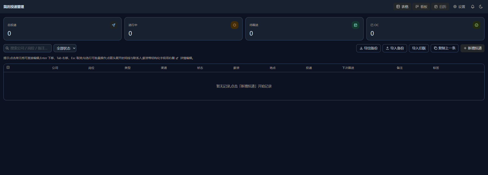
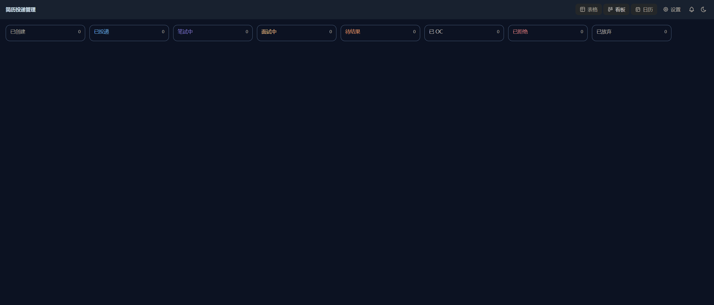
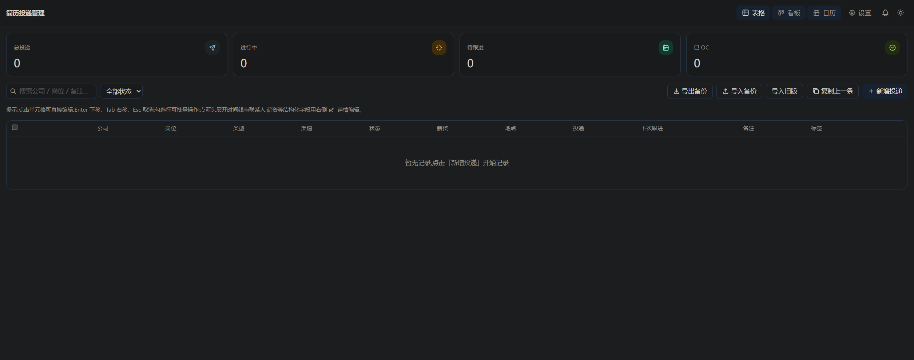
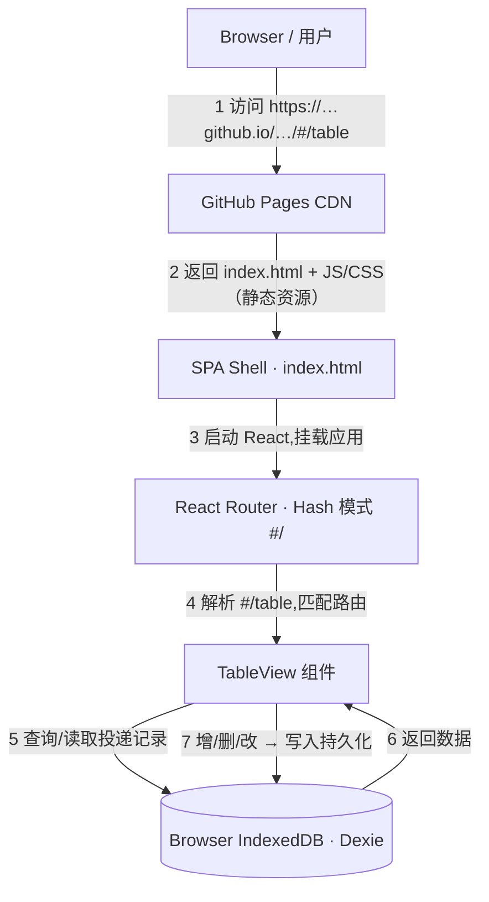

# 简历投递追踪系统 · Resume Submission Tracker

> 本地优先(local-first)的求职投递与面试管理工具。所有数据只存在你自己的浏览器里(IndexedDB),**不上传任何服务器**。单页应用(SPA),部署在 GitHub Pages,另提供 PWA / Android / 桌面客户端。

[](LICENSE)
&nbsp;**在线使用** → <https://miaomaioji.github.io/Resume-submission-tracking/>

---

## 1. 项目简介

面向求职者(尤其校招/实习)的「投递与面试进度管理」工具,把**投递记录、状态流转、面试安排、跟进节奏**集中到一处:

- 📋 高密度**表格**(`#/table`):增删改查、Excel 式内联编辑、搜索 / 筛选 / 排序、批量操作
- 🏷️ **状态标签**:8 态状态机 + 自定义标签;里程碑**时间线**记录每次状态变化
- ⏰ **超时变色**:投递长时间无响应自动按颜色提示,阈值可**按渠道**单独设置
- 🗂️ **看板**(拖拽改状态)/ **日历**(面试·跟进)/ 三视图联动 / 面试**防撞车**
- 🔔 应用内**提醒中心**、**ICS** 日历导出、**JSON 导出/备份**、🌗 深色模式
- 💾 纯本地存储,**刷新不丢**;支持装成 PWA / APK / 桌面应用离线使用

开源协议 **GPL-3.0**。

---

## 2. 功能截图

> 📷 以下为项目实际截图，图片位于 `docs/screenshots/`。

| 表格视图(内联编辑) | 看板(拖拽改状态) |
| :---: | :---: |
|  |  |
| **日历 + 防撞车** | **深色模式** |
|  |  |

---

## 3. 技术栈清单

| 类别 | 选型 |
| --- | --- |
| **框架** | React 18 + TypeScript |
| **构建工具** | Vite 6（+ `vite-plugin-pwa`） |
| **UI 库** | Tailwind CSS 4 · Tabler Icons · TanStack Table（表格）· dnd-kit（拖拽）· react-big-calendar（日历） |
| **路由模式** | React Router v6 — **Hash 模式（`#/`）** |
| **数据存储** | **IndexedDB**（经 [Dexie](https://dexie.org/) 封装)— 本地优先,无后端 |
| **状态/表单** | Zustand · react-hook-form + zod · Day.js |
| **测试/质量** | Vitest · ESLint · Prettier · TypeScript strict |
| **多端打包** | PWA · Capacitor（Android APK）· Electron（macOS / Windows 桌面） |


---

## 4. 本地开发指南(Install & Run)

需要 **Node.js 18+**。

```bash
# 克隆并进入项目目录
git clone https://github.com/miaomaioji/Resume-submission-tracking.git
cd Resume-submission-tracking

npm install        # 安装依赖

npm run dev        # 开发服务器 → http://localhost:5173
npm run build      # 类型检查 + 生产构建(产物在 dist/)
npm run preview    # 预览生产构建 → http://localhost:4173
npm run test       # 单元测试(Vitest)
npm run lint       # 代码检查
```

> 打开后是空表,点「新增投递」开始;或点「导入旧版」读取早期单文件原型(`legacy/job_tracker_v2.html`)的本地数据。

---

## 5. 项目架构图

用户访问 URL → GitHub Pages 返回 SPA → Hash 路由解析 → 组件渲染 → 读写本地 IndexedDB:




---

## 6. 部署说明

### 当前:GitHub Pages(已配置)

- GitHub Actions(`.github/workflows/deploy.yml`)在推送 `main` 时自动 `build` 并发布到 Pages。
- 关键配置:
  - `vite.config.ts` 构建时 `base = '/Resume-submission-tracking/'`(= 仓库名,项目子路径);本地 dev 用 `/`。
  - 路由用 **HashRouter**:静态托管对未知深链接(如 `/settings`)会 404,Hash 模式(`/#/settings`)从根 `index.html` 客户端解析,**无需 404 回退**。
- 一次性操作:仓库 **Settings → Pages → Source 选 “GitHub Actions”**。

### 迁移到 Vercel 的坑点

| 坑点 | 说明 / 解决 |
| --- | --- |
| **base 路径** | Pages 用子路径 `/<仓库名>/`,Vercel 是根域名 `/`。迁移前把 `vite.config.ts` 的 `base` 改回 `'/'`,否则资源全 404。 |
| **SPA 回退** | Pages 靠 HashRouter 规避 404;Vercel 原生支持 SPA(框架预设选 **Vite** 即自动 rewrite 到 `index.html`)。 |
| **想用干净 URL** | 在 Vercel 上可把 `createHashRouter` 换成 `createBrowserRouter`,并加 `vercel.json` rewrites 把所有路径回退到 `/index.html`。 |
| **构建设置** | Build Command `npm run build`,Output Directory `dist`。 |
| **PWA / SW 缓存** | 换域名后旧 Service Worker 缓存可能残留;`registerType: 'autoUpdate'` 会自动更新,必要时让用户硬刷新一次。 |

> 数据在用户**本地浏览器**,与部署平台无关;换平台/域名不会迁移已有数据(不同 origin 各自独立,见 FAQ)。

### 其他客户端(Releases)

推送 `v*` tag 时,`release.yml` 统一构建并发布到 [Releases](https://github.com/miaomaioji/Resume-submission-tracking/releases):Android `.apk`、macOS `.dmg`、Windows `.exe`(均为未签名,个人自用)。

---

## 7. 常见问题(FAQ)

**Q:数据存在哪?刷新或关闭会丢吗?**
存在浏览器 **IndexedDB**,刷新/关闭都**不会丢**。但「清除浏览器数据」、卸载、换设备会清空——请用工具栏 **导出备份**(JSON)定期备份。

**Q:换浏览器/设备怎么迁移数据?**
旧环境 **导出备份** → 新环境 **导入备份**(支持合并/覆盖)。

**Q:为什么 localhost、线上 Pages、桌面客户端的数据不互通?**
它们是**不同的 origin**,IndexedDB 按 origin 隔离,各存各的。要搬数据走导出/导入。

**Q:为什么用 Hash 路由(`#/`)而不是干净 URL?**
GitHub Pages 是静态托管,对 `/table` 这类深链接会返回 404。Hash 模式由前端在根 `index.html` 内解析,**部署即用、零额外配置**。迁到 Vercel 等支持 SPA rewrite 的平台后可切回 History 模式。

**Q:数据会上传服务器吗?**
**不会。** 纯本地优先,无后端、无账号、无埋点上报。

**Q:支持手机和桌面吗?**
支持。浏览器里可「添加到主屏幕/安装」成 PWA;也可在 [Releases](https://github.com/miaomaioji/Resume-submission-tracking/releases) 下载 Android APK 与桌面安装包(未签名,安装时按系统提示放行)。

---

## 许可证

[GPL-3.0](LICENSE) © miaomaioji
